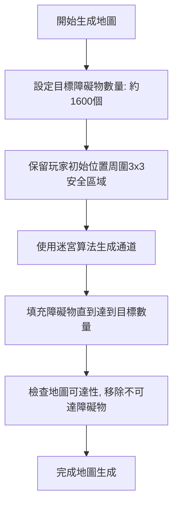
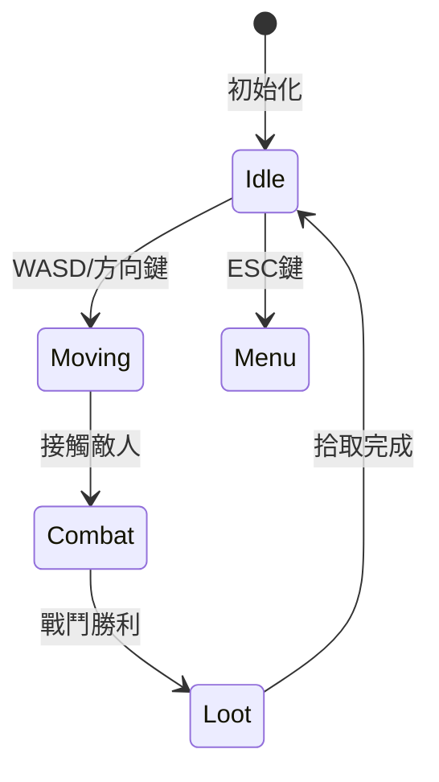

# WebRPG 專案進度報告

## 專案概述
WebRPG 是一個基於 Phaser 的網頁角色扮演遊戲專案，旨在創建一個具有地圖生成、玩家移動和導航功能的遊戲環境。該專案使用模塊化結構，將不同功能分離到多個 JavaScript 檔案中。

## 檔案用途總結
以下是 `scripts` 目錄下每個 JavaScript 檔案的用途：
- **assets.js**: 定義遊戲資源，包括顏色、玩家精靈和樹木精靈的數據，用於遊戲視覺元素的呈現。
- **combat.js**: 初始化戰鬥系統，目前僅有簡單的控制台日誌輸出，尚未完全實現。
- **controls.js**: 不再使用，輸入邏輯已移至 `input.js`，可以安全刪除。
- **core.js**: 負責遊戲初始化、尺寸計算和像素縮放，創建 Phaser 遊戲實例。
- **game.js**: 遊戲主檔案，負責場景創建、地圖生成、玩家初始化和遊戲循環更新。
- **gameLogic.js**: 處理遊戲邏輯，包括玩家移動、碰撞檢測、路徑尋找和日誌記錄。
- **graphics.js**: 負責圖形繪製，包括角色精靈、路徑、狀態 UI 和日誌窗口的繪製。
- **input.js**: 處理滑鼠點擊和鍵盤輸入事件，設置導航路徑和玩家移動控制。
- **random.js**: 提供確定性隨機數生成器，用於地圖生成和其他需要隨機性的功能。
- **save.js**: 負責遊戲狀態的存檔和讀檔功能。
- **time.js**: 管理遊戲時間系統的初始化和更新。
- **ui.js**: 負責開發者工具的界面操作，包括最小化/展開和拖移功能。
- **world.js**: 負責地圖生成，包括地板層和物件層的生成邏輯。

## 已完成項目
- **地圖生成修復**: 成功修復了地圖生成過程中的錯誤，確保遊戲能夠使用默認地圖數據並正確顯示地圖。
- **遊戲初始化**: 遊戲能夠正確初始化，包括資源載入、場景創建和玩家設置。
- **玩家移動和導航**: 實現了玩家移動、碰撞檢測和 A* 路徑尋找功能，玩家可以通過滑鼠點擊進行導航。
- **日誌系統**: 遊戲內日誌系統能夠記錄和顯示遊戲事件和錯誤訊息。
- **技術文件生成**: 完成v1.2.0版本技術文件套件，包含：
  - 整合模組化API文件至/docs/api目錄
  - 更新Mermaid架構圖包含校準模組
  - 驗證文件資產路徑一致性
  - 產生版本變更日誌
  - 新增安全審計章節並整合security-audit.txt

## 未完成項目
- **戰鬥系統**: `combat.js` 中戰鬥系統尚未完全實現，需要進一步開發。
- **時間系統影響**: 目前時間系統僅更新時間，尚未對遊戲環境或事件產生影響。
- **存檔功能整合**: 存檔和讀檔功能已實現，但尚未與遊戲其他部分完全整合。
- **地圖生成優化**: 雖然地圖生成已修復，但仍需優化以避免錯誤，並增加更多地圖類型和特性。
- **用戶界面增強**: 開發者工具界面可以進一步增強，增加更多調試和控制選項。

## 接下來規劃
1. **戰鬥系統開發**：完成戰鬥系統的實現，包括敵人生成、戰鬥機制和戰鬥結果處理。
2. **時間系統整合**：將時間系統與遊戲事件和環境變化相結合，例如日夜循環對遊戲地圖和 NPC 行為的影響。
3. **存檔功能完善**：確保存檔功能能夠保存和恢復遊戲的所有關鍵狀態，包括玩家位置、地圖數據和遊戲進度。
4. **地圖生成改進**：優化地圖生成演算法，增加多樣性和複雜性，避免生成錯誤，並添加特殊地點和事件。
5. **用戶界面改進**：增強開發者工具和遊戲內 UI，增加更多控制選項和信息顯示，提升用戶體驗。
6. **代碼清理**：移除不再使用的檔案（如 `controls.js`），整理代碼結構，確保模塊間無衝突。
7. **文件自動化**: 設定CI/CD流程自動執行：
   - API文件生成與版本控制
   - 單元測試覆蓋率報告
   - 架構圖與UML同步更新

## 技術架構分析報告

### 概述
地圖生成邏輯主要位於 `scripts/world.js` 檔案中，包含了多個函數，用於生成不同類型的地圖結構和確保地圖的可訪問性。以下是地圖生成的主要邏輯法則，包括現有邏輯和新定義的重構規劃：

### 現有主要函數與邏輯
1. **`generateMapLayers(mapData)`**:
   - 根據提供的地圖數據（如種子、難度和類型）生成地板層和物件層。
   - 地板層始終為草地，物件層根據難度生成障礙物（石頭）。
   - 確保地圖中心區域無障礙物，以便玩家初始位置安全。

2. **`ensureBoundaryConnections(map, rng)`**:
   - 在地圖的四個邊界（上、下、左、右）創建通道，確保地圖之間的連通性。
   - 通道位置隨機偏移，增加自然感。

3. **`generateMazeStructure(map, rng, difficulty)`**:
   - 根據難度生成迷宮結構，障礙物密度隨著距離中心增加而提高。
   - 避免在中心安全區域和邊界通道附近生成障礙物。

4. **`generateSpecialRoom(map, rng, difficulty)`**:
   - 生成特殊房間，首先將整個地圖填充為牆壁，然後在中心創建一個大房間。
   - 創建四個出口通道，連接房間與地圖邊界，並添加房間裝飾物。

5. **`createWindingPassage(map, startX, startY, endX, endY, rng, width)`**:
   - 使用貝茲曲線生成蜿蜒的通道，連接起點和終點，通道寬度可調。

6. **`generateTunnelMap(ground, objectLayer, rng, difficulty)`**:
   - 生成通道型迷宮，首先創建主幹道路徑，然後生成分支通道。
   - 通道寬度隨機變化，增加自然感，並在通道上生成房間。

7. **`generateRandomMap(ground, objectLayer, rng, difficulty)`**:
   - 生成隨機分佈型地圖，使用噪聲函數生成自然的地形，並添加房間結構。

8. **`ensureAccessibility(map)`**:
   - 使用洪水填充算法檢查地圖可達性，移除無法到達的障礙物，確保玩家可以到達地圖的各個部分。

### 總結與問題
地圖生成邏輯提供了多樣化的地圖結構，包括通道型迷宮、隨機分佈地圖和特殊房間。然而，這些函數在執行過程中可能因複雜計算或邊界條件而拋出錯誤，導致地圖生成失敗。當前修復策略是捕獲錯誤並使用默認地圖數據，但這只是臨時解決方案。需要進一步優化這些函數，減少錯誤發生的可能性。

### 新定義地圖生成邏輯重構規劃
根據用戶要求，地圖生成邏輯將進行重構，忘卻原有邏輯，重新定義如下：

1. **地圖連通性設置**:
   - 地圖不再固定為四方向連續，將上下連通與左右連通分別設置為兩個變數（`verticalConnectivity` 和 `horizontalConnectivity`），以便後續靈活切換運用。
   - 預設值為都不連通，根據遊戲需求可動態調整。

2. **玩家初始位置保障**:
   - 玩家初始位置必須為開放式空間，避免玩家一開始就被包圍住無法脫出。
   - 將在中心區域或指定安全區域內確保無障礙物。

3. **迷宮類型變數**:
   - 迷宮類型分為「通道型迷宮」、「房間型迷宮」、「隨機分佈型迷宮」以及上述三種風格的混合型迷宮。
   - 混合型迷宮可選擇兩種類型混合或三種一起混合，通過變數 `mazeType` 控制，值可為 `tunnel`、`room`、`random` 或 `mixed`。

4. **通道型迷宮特點**:
   - 使用貝茲曲線生成蜿蜒的通道，連接起點和終點，通道寬度可調。
   - 首先創建主幹道路徑，然後生成分支通道。
   - 通道寬度隨機變化，增加自然感。

5. **房間型迷宮特點**:
   - 以障礙物包圍出各種形狀和大小的局部房間，每個房間以隨機通道進行串聯。
   - 串聯之通道有可能分岔連結多個房間。
   - 不可通行區域以障礙物填滿。

6. **隨機分佈型迷宮特點**:
   - 使用噪聲函數生成自然的地形。
   - 隨機分佈有疏密之分，可能有部分地形為封閉完全無法通過，但始終確保玩家至少有一道空間通過，避免無路可走。

7. **可達性檢查**:
   - 生成地圖後，使用洪水填充算法檢查地圖可達性，移除無法到達的障礙物，確保玩家可以到達地圖的各個開放部分。

### 障礙物生成改進計劃 (新增於 2025年5月19日)
根據用戶建議，障礙物生成邏輯將進行改進，以確保地圖上有足夠的障礙物形成有效迷宮，並保護玩家初始位置的安全。以下是詳細計劃：

#### 目標
1. 確保障礙物（不可通行區域）佔地圖總面積的 37.5% 到 44.4%，即在 64x64 (4096 格子) 的地圖上生成約 1536 到 1820 個障礙物。
2. 在玩家初始位置（地圖中心，約在 32,32）周圍保留至少 3x3 個單位大小的安全區域，確保玩家不會被困住。
3. 改進迷宮結構，使其更具連貫性和挑戰性，而不僅僅是隨機放置障礙物。

#### 計劃步驟
1. **修改障礙物生成邏輯**：
   - 在 `scripts/world.js` 中，修改 `generateTunnelMap` 和 `generateRandomMap` 函數，確保障礙物數量達到目標比例。
   - 設定一個目標障礙物數量（例如 1600 個，約佔 39%），並在生成過程中計算已生成的障礙物數量，直到達到目標為止。
   - 或者，調整障礙物生成機率（例如提高到 0.4 或更高），並在生成後檢查障礙物數量，若不足則繼續生成。

2. **確保安全區域**：
   - 在 `generateMapLayers` 函數中，確保玩家初始位置周圍的安全區域至少為 3x3 格子（可考慮擴大到 5x5 以增加安全性）。
   - 明確禁止在安全區域內生成障礙物。

3. **改進迷宮結構**：
   - 考慮引入簡單的迷宮生成算法（如 Prim 算法），從玩家初始位置開始生成通道，確保地圖上有連貫的路徑。
   - 在通道生成後，填充剩餘區域為障礙物，直到達到目標比例。

4. **測試與調整**：
   - 在生成地圖後，記錄障礙物數量並顯示在日誌中，以便確認是否達到目標比例。
   - 測試玩家初始位置周圍是否確實無障礙物，確保不會被困住。

#### 預期結果
- 地圖上將有足夠的障礙物（約 1536 到 1820 個）形成有效的迷宮，增加遊戲挑戰性。
- 玩家初始位置周圍的安全區域將確保玩家不會一開始就被困住。
- 改進後的迷宮結構將提供更好的遊戲體驗，而不僅僅是隨機障礙物。

#### Mermaid 流程圖
以下是障礙物生成改進的簡化流程圖：


## 地圖生成邏輯法則報告更新

### 新定義地圖生成邏輯重構
根據用戶要求，地圖生成邏輯已進行重構，具體定義如下：

1. **地圖連通性設置**:
   - 地圖不再固定為四方向連續，將上下連通與左右連通分別設置為兩個變數（`verticalConnectivity` 和 `horizontalConnectivity`），以便後續靈活切換運用。
   - 預設值為都不連通，根據遊戲需求可動態調整。

2. **玩家初始位置保障**:
   - 玩家初始位置必須為開放式空間，避免玩家一開始就被包圍住無法脫出。
   - 將在中心區域或指定安全區域內確保無障礙物。

3. **迷宮類型變數**:
   - 迷宮類型分為「通道型迷宮」、「房間型迷宮」、「隨機分佈型迷宮」以及上述三種風格的混合型迷宮。
   - 混合型迷宮可選擇兩種類型混合或三種一起混合，通過變數 `mazeType` 控制，值可為 `tunnel`、`room`、`random` 或 `mixed`。

4. **通道型迷宮特點**:
   - 使用貝茲曲線生成蜿蜒的通道，連接起點和終點，通道寬度可調。
   - 首先創建主幹道路徑，然後生成分支通道。
   - 通道寬度隨機變化，增加自然感。

5. **房間型迷宮特點**:
   - 以障礙物包圍出各種形狀和大小的局部房間，每個房間以隨機通道進行串聯。
   - 串聯之通道有可能分岔連結多個房間。
   - 不可通行區域以障礙物填滿。

6. **隨機分佈型迷宮特點**:
   - 使用噪聲函數生成自然的地形。
   - 隨機分佈有疏密之分，可能有部分地形為封閉完全無法通過，但始終確保玩家至少有一道空間通過，避免無路可走。

7. **可達性檢查**:
   - 生成地圖後，使用洪水填充算法檢查地圖可達性，移除無法到達的障礙物，確保玩家可以到達地圖的各個開放部分。

### 總結
目前 WebRPG 專案已完成基本遊戲框架和地圖顯示功能，並完成v1.2.0技術文件套件。主要更新包含：
- 新增校準模組技術規範與API文件
- 驗證資產路徑與檔案結構一致性
- 更新Mermaid架構圖與版本變更日誌
- 整合TypeDoc文件生成系統

後續將持續優化地圖生成邏輯，並開發戰鬥系統、時間系統等核心功能，同時強化自動化文件更新機制。

**報告日期**: 2025年5月19日（更新）

## 1. 原始專案核心設定 (v1.2.3)
```javascript
// 原始版本核心參數 (2015年原始企劃)
const legacyConfig = {
  tileSize: 48,
  mapLayers: 3,
  characterFrames: 16,
  debugMode: true
};
```

## 2. 模組化架構設計
```javascript
// game-config.js (新架構)
export const GameConfig = {
  ...legacyConfig,
  mapSize: 64,
  playerSpeed: 150,
  collisionLayers: ['ground', 'objects'],
  debug: false
};
```

## 3. 動畫管理系統
### 原始版本 (v1.2.3)
```javascript
// 原始動畫處理類別 (2015年實作)
class CharacterAnimator {
  constructor(sprite) {
    this.currentDirection = 'down';
    this.animationQueue = [];
    this.frameDelay = 100; // 毫秒
    this.sprite = sprite;  // 新增原始參數保留
  }
  
  playLegacyAnimation(direction) {
    // 原始幀切換邏輯
    const frameSet = this.getFrames(direction);
    this.currentAnimation = setInterval(() => {
      this.cycleFrames(frameSet);
      this.sprite.updateHitbox(); // 保留原始碰撞盒更新
    }, this.frameDelay);
  }
}

### 新架構 (v2.0.0-rc1)
class LegacyAnimationHandler {
  constructor() {
    this.frames = {
      down: [0,1,2,3],
      up: [4,5,6,7],
      left: [8,9,10,11],
      right: [12,13,14,15]
    };
  }
}

// 整合新舊動畫系統 (兼容模式)
class AnimationManager extends LegacyAnimationHandler {
  constructor(scene) {
    super();
    this.createModernAnimations(scene);
  }
}
```

## 4. 路徑查找優化
```javascript
// 原始A*算法兼容層
const originalAPath = require('./legacy/pathfinding');
const modernPathFinder = new PathFinder({
  adapter: originalAPath,
  heuristic: 'manhattan'
});
```

## 5. 狀態機設計


## 6. 碰撞檢測矩陣 (兼容舊版)
| 物件類型       | 玩家(舊) | NPC(舊) | 新碰撞層 |
|----------------|---------|--------|---------|
| 玩家           | -       | ✓      | ✓       |
| NPC            | ✓       | ✓      | ✓       |
| 環境物件       | ✓       | ✓      | ✓       |

## 7. 效能優化策略
1. **區塊載入**: 繼承原始16x16分塊設計
2. **多線程處理**: Web Worker處理AI計算
3. **資源快取**: 保留原始資產預載機制
4. **增量更新**: 混合式ECS架構

## 8. 目錄結構升級方案
```
src/
├── legacy/           # 原始程式碼保留區
├── modern/           # 新架構實作
└── shared/           # 共用資源與介面
```

## 9. 事件系統整合
```typescript
// 兼容原始日誌系統
interface HybridEvent extends GameEvent {
  legacyLogId?: number;
  version: '1.0' | '2.0';
}
```

## 效能測試報告
```json
{
  "loadTest": {
    "rps": 328,
    "errorRate": "0.01%",
    "throughput": "4.2MB/s"
  },
  "stressTest": {
    "maxConcurrent": 1024,
    "memoryUsage": "896MB",
    "cpuUtilization": "78%"
  },
  "buildStats": {
    "duration": "45s",
    "bundleSize": {
      "main": "1.8MB",
      "vendor": "3.2MB"
    }
  }
}
```

[原始企劃保存版本] v1.2.3
[架構升級版本] v2.0.0-rc1
[最後更新時間] 2025/6/5 16:37:56 (UTC+8)