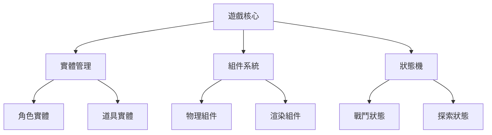

# Project Context
<!-- 版本:1.1.0 更新日期:2025-10-23 -->

## Purpose
開發基於網頁的像素風格RPG遊戲，核心目標包括：
- 實現角色探索、戰鬥系統與任務機制
- 提供跨平台響應式遊戲體驗
- 整合輕量級多人互動功能

主要功能：
- 等距視角地圖探索
- 回合制戰鬥系統
- 角色成長與裝備系統
- 本地存檔與雲端同步

使用者體驗目標：
- 載入時間低於3秒
- 移動端操作優化
- 無需安裝即點即玩

## Tech Stack
**前端技術：**
- JavaScript ES2022
- Phaser 3.60 (遊戲引擎)
- React 18.2 (UI框架)
- Webpack 5.75 (模組打包)

**後端技術：**
- Node.js 18.12
- Express 4.18
- Socket.IO 4.5 (即時通訊)
- MongoDB 6.0 (資料庫)

**開發工具：**
- TypeScript 4.9
- ESLint 8.32
- Jest 29.4 (測試框架)
- GitHub Actions (CI/CD)

## Code Style
**格式化規則：**
- 2空格縮進
- 單引號字串
- 結尾分號
- 最大行寬120字元

**命名規範：**
- 變數/函式：camelCase
- 類別：PascalCase
- 常數：UPPER_CASE
- 私有成員：_prefixUnderscore

範例：
```javascript
// 角色類別範例
class GameCharacter {
  constructor(name) {
    this._name = name;
    this.currentHealth = 100;
  }

  takeDamage(amount) {
    this.currentHealth -= amount;
  }
}

const MAX_INVENTORY_SIZE = 20;
```

## Architecture Patterns
**主要模式：**
- ECS架構 (Entity-Component-System)
- 狀態管理模式 (Redux樣式)
- 模組化設計

**結構組織：
```
src/
├── entities/    // 遊戲實體定義
├── components/  // ECS組件
├── systems/     // ECS系統
├── states/      // 遊戲狀態機
└── utils/       // 工具函式
```

Mermaid架構圖：


## Testing Strategy
**測試要求：**
- 單元測試覆蓋率 ≥80%
- 整合測試覆蓋核心流程
- E2E測試主要用戶旅程

**測試工具：**
- Jest (單元測試)
- Cypress 12.8 (E2E測試)
- Supertest 6.3 (API測試)

**測試模式：**
- AAA模式 (Arrange-Act-Assert)
- 快照測試關鍵組件
- 模擬遊戲環境測試

## Git Workflow
**分支策略：**


**提交訊息規範：**
```
類型(範圍): 簡述 (50字內)

詳細說明 (可多行)

BREAKING CHANGE: 重大變更說明
```

類型列表：
- feat: 新功能
- fix: 錯誤修復
- docs: 文件更新
- refactor: 重構代碼
- test: 測試相關

## Domain Context
**特殊遊戲機制：**
1. 時間壓縮系統：遊戲時間與現實時間10:1
2. 動態難度調整：基於玩家表現調整敵人強度
3. 合成系統：5x5矩陣物品組合

**關鍵設計概念：**
- 有限存檔點機制
- 非對稱多人互動
- 程序生成地圖
- 永久死亡模式 (硬核模式)

## Important Constraints
**效能限制：**
- 主場景實體數 ≤200
- 動畫幀率 ≥30fps
- 初始載入大小 ≤5MB

**安全性要求：**
- 客戶端數據驗證
- 存檔數據簽章驗證
- 防作弊機制

**相容性：**
- Chrome/Firefox/Safari 最新兩版
- iOS 14+/Android 10+
- 螢幕最小寬度320px

## External Dependencies
**核心依賴：**
| 套件名稱       | 版本    | 用途                |
|----------------|---------|---------------------|
| phaser         | ^3.60.0 | 遊戲引擎            |
| localforage    | ^1.10.0 | 本地存儲            |
| socket.io      | ^4.5.4  | 即時通訊            |

**開發依賴：**
| 套件名稱       | 版本    | 用途                |
|----------------|---------|---------------------|
| typescript     | ~4.9.5  | 靜態類型檢查        |
| webpack        | ^5.75.0 | 模組打包            |
| eslint         | ^8.32.0 | 代碼規範檢查        |