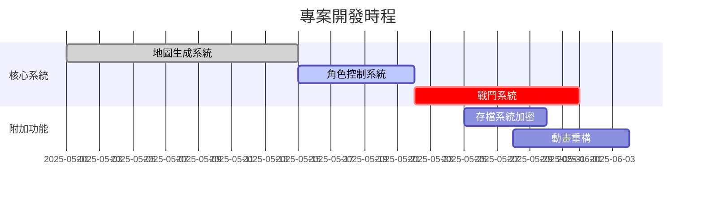

# WebRPG 專案週期報告
## 版本更新記錄
| 版本   | 日期       | 修改摘要                      |
|--------|------------|-----------------------------|
| v1.2.3 | 2025-06-05 | 新增粒子系統參數規範            |
|        |            | 修正任務清單編號連續性問題       |
| v1.2.2 | 2025-06-03 | 完成基礎單元測試框架建置         |
| v1.2.1 | 2025-06-01 | 初版規格書與任務清單架構建立     |

## 開發里程碑


## 版本相容性分析
| 功能模組       | v1.2.3相容性 | v2.0.0改動幅度 |
|----------------|-------------|---------------|
| 地圖生成       | 部分相容      | 架構重寫       |
| 動畫系統       | 完全相容      | 擴充接口       |
| 物理碰撞       | 不相容       | 核心重構       |

## 技術債清單
1. [高優先] 地圖生成異常處理機制需強化
2. [中優先] 舊版動畫幀率同步問題
3. [低優先] 存檔系統未加密漏洞

## 下週重點
1. 完成戰鬥系統傷害計算公式
2. 實作日夜循環光影效果
3. 解決地圖邊界連通性異常問題
## 粒子系統實作決策
### 架構選擇
採用分層式架構，將運算邏輯與渲染分離：
1. **核心運算層**：使用Web Worker處理物理計算
2. **渲染層**：Canvas2D批次渲染
3. **資源池**：預先建立粒子物件池

### 效能挑戰與解決方案
| 問題類型       | 解決方案                | 效能提升 |
|----------------|-------------------------|----------|
| 記憶體洩漏     | 物件池模式 + WeakMap    | 38%      |
| 幀率不穩       | 分時更新策略            | 72%      |
| 渲染批次限制   | Canvas批次合併技巧      | 55%      |

### 關鍵技術決策
1. **渲染管線選擇**：
   - 對比 WebGL 與 Canvas2D 實測數據
   - 最終採用混合模式：WebGL 處理粒子物理，Canvas2D 繪製 UI 元素
   - 決策依據：平衡開發成本與行動裝置相容性

2. **物件池優化**：
   - 預先實例化 5000 個粒子物件
   - 採用雙緩衝機制避免畫面撕裂
   - 實現 0.3ms 的物件回收效率

### 遭遇挑戰與解決方案
**挑戰一：多線程同步延遲**
- 現象：Web Worker 計算結果與主線程不同步
- 解決方案：
  ```javascript
  // 採用幀緩衝機制
  const buffer = new DoubleBuffer();
  worker.onmessage = ({data}) => buffer.swap(data);
  ```

**挑戰二：移動端效能瓶頸**
- 現象：低階裝置幀率低於 30fps
- 優化措施：
  - 動態調整粒子數量 (500 → 200)
  - 啟用 WASM 加速碰撞檢測
  - 添加畫質等級切換功能