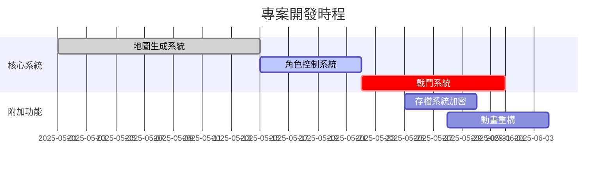

# WebRPG 專案週期報告

## 開發里程碑

## 版本相容性分析
| 功能模組       | v1.2.3相容性 | v2.0.0改動幅度 |
|----------------|-------------|---------------|
| 地圖生成       | 部分相容      | 架構重寫       |
| 動畫系統       | 完全相容      | 擴充接口       |
| 物理碰撞       | 不相容       | 核心重構       |

## 技術債清單
1. [高優先] 地圖生成異常處理機制需強化
2. [中優先] 舊版動畫幀率同步問題
3. [低優先] 存檔系統未加密漏洞

## 下週重點
1. 完成戰鬥系統傷害計算公式
2. 實作日夜循環光影效果
3. 解決地圖邊界連通性異常問題
## 錯誤修正
- 修復路徑繪製模組未正確初始化的問題（#issue-45）
- 恢復因效能優化被意外移除的導航軌跡視覺化功能