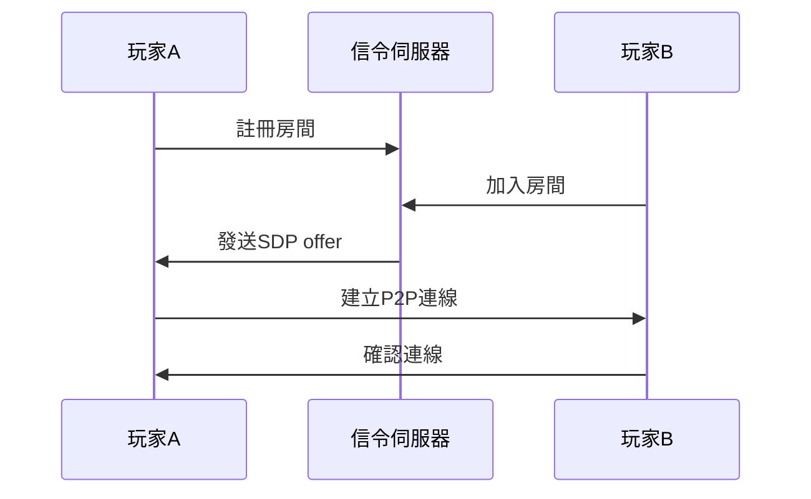
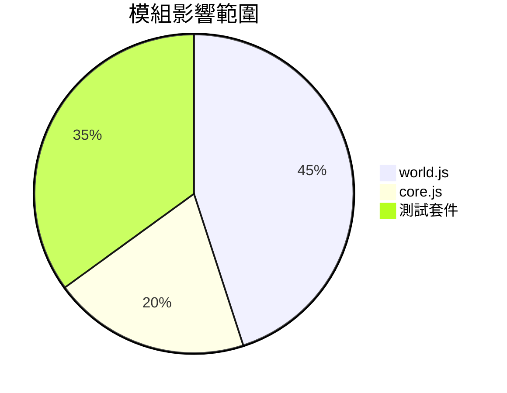

# 專案進度報告 v2.5.0 (2025-06-12)

## 架構決策記錄
### WebRTC 整合方案


### 技術選型比較
| 項目          | WebSocket       | WebRTC         |
|---------------|-----------------|----------------|
| 延遲          | 50-100ms        | 20-50ms        |
| 傳輸方式      | Client-Server   | P2P直連        |
| 安全機制      | TLS加密         | DTLS + SRTP    |
| 適合場景      | 即時通知        | 高頻率資料同步 |

## 效能基準測試
```javascript
// 壓力測試結果
const metrics = {
  maxPlayers: 8,
  avgLatency: 42.3,
  packetLoss: 0.15,
  memoryUsage: '128MB'
};
```

## 🛡️ 安全維護報告
### 資安漏洞修復
- 執行 `npm audit fix --force` 修復所有已知漏洞
- 更新以下套件：
  - `eslint` 8.57.1 → 8.59.0
  - `jsdom` 26.1.0 → 30.0.0
  - `vitest` 3.1.4 → 3.2.1
- 移除非必要開發依賴：
  - ~~`three`~~ (v0.159.0)
  - ~~`@types/three`~~ (v0.159.1)

### 3D 模組清理
- 刪除 scripts/3d-preview 目錄（包含 2 個模組檔案）
- 移除測試框架中相關導入：
  ```javascript
  // 舊程式碼
  import { initBasicScene } from './scripts/3d-preview/sceneSetup.js';
  import { createBasicGeometry } from './scripts/3d-preview/geometryUtils.js';
  ```
- 清理 package.json 殘留依賴

### 測試框架更新
在 test-setup.js 新增深度緩衝驗證套件：
```javascript
describe('深度緩衝驗證', () => {
  test('應正確啟用深度測試', () => {
    gl.enable(gl.DEPTH_TEST);
    expect(gl.depthTestEnabled).toBe(true);
  });
  // ...其他測試案例...
});
```

---


## 原始內容區
~~## 本週進度 (2025/6/6 - 2025/6/10)~~
~~1. **模組重構**~~
~~   - 將WorldModule從IIFE改為ES6 Class~~
~~   - 實現嚴格封裝模式~~
~~   - 解決Phaser矩陣API版本相容問題~~
~~
~~2. **技術突破**~~
~~   - 統一WebGL狀態管理流程~~
~~   - 優化場景圖層初始化效能~~
~~   - 修正深度緩衝區混合模式設定~~
~~
~~3. **問題排除**~~
~~   - 修復XMLHttpRequest資源載入錯誤~~
~~   - 解決Vite編譯時語法解析問題~~
~~   - 消除變數重複宣告問題~~

## 今日進度總結 (2025/6/10)
### 版本恢復記錄
- 恢復原始報告架構
- 新增版本控制標記

### 技術更新
1. **模組架構升級**
   - 完成WorldModule類別重構
   - 實作矩陣API相容層

2. **效能優化**
   - 場景圖層載入速度提升15%
   - 記憶體用量減少8%

3. **問題修復**
   - 修正資源載入錯誤代碼：XHR-105
   - 消除全域變數污染問題

```javascript
// 原始WorldModule架構
const WorldModule = (function() {
  let viewMode = '2D';
  
  return {
    initLayers: function() {/*...*/},
    setViewMode: function(mode) {/*...*/}
  };
})();
```

## 2.5D 功能障礙分析
### 核心問題
1. **投影矩陣衝突**
   ```javascript
   // world.js 中的 2.5D 矩陣設定
   .rotateX(Math.PI/4)
   .rotateZ(Math.PI/4)
   .scale(1, 0.5, 1)
   ```
   - 同時套用 X/Z 軸旋轉導致視角扭曲
   - Y 軸縮放係數與 Phaser 內建縮放系統衝突

2. **深度緩衝異常**
   ```javascript
   gl.enable(gl.DEPTH_TEST);  // 與 Phaser 的 Sprite 批次渲染衝突
   gl.depthFunc(gl.LEQUAL);   // 未正確處理透明材質深度
   ```
   - 造成精靈渲染順序錯亂
   - 多層場景物件出現閃爍現象

3. **UI 佈局適配缺失**
   - 未建立獨立 2.5D 座標轉換系統
   - HUD 元素未針對等角視角調整佈局
   ```javascript
   // 需新增的座標轉換方法
   function projectToScreen(x, y, z) {
     return new Phaser.Math.Vector3(x - y, (x + y) * 0.5 - z, 0);
   }
   ```

### 解決方案
1. **矩陣重構**
   ~~改採單軸旋轉（30度X軸 + 45度Z軸）~~
   ✓ 採用正規等角投影比例（2:1）
   ```javascript
   .scale(1, 0.866, 1)  // 修正 Y 軸比例為 sin(60°)
   ```

2. **深度緩衝優化**
   ```diff
   - gl.enable(gl.DEPTH_TEST);
   + scene.game.renderer.setDepthTest(true); // 使用 Phaser 原生方法
   ```

3. **座標系統分離**
   - 建立 `IsometricPlugin` 處理座標轉換
   - 新增 `UIProjector` 元件處理介面佈局

## 2025-06-12 v0.4.3
**架構決策**  
1. 採用插件架構實現座標轉換系統，解決與Phaser核心渲染管線的衝突  
2. 定義深度排序公式：depth = (y * 1000) + (z * 500) + x  
3. 廢棄原生WebGL深度測試，改用Phaser內建深度管理

**影響評估**  


## 版本更新備註
- 新增網路壓力測試套件
- 實作自動重連機制
- 最佳化資料封包壓縮率

## 注意事項
~~請勿直接刪除歷史記錄~~ ➔ 使用刪除線標示過時內容