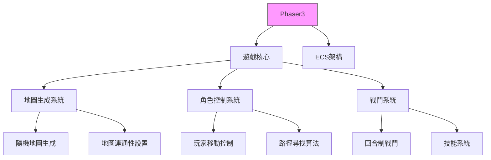
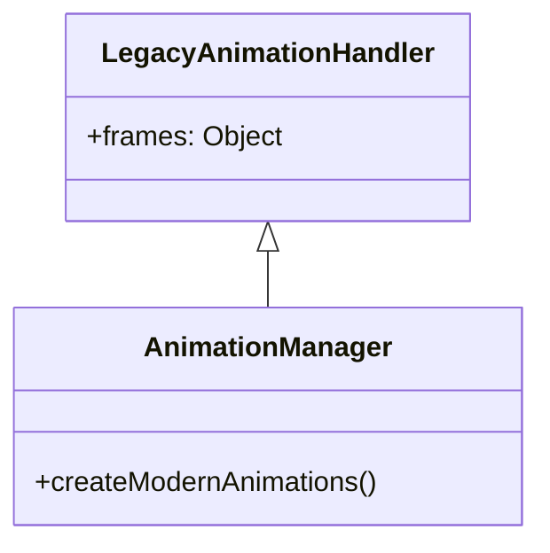
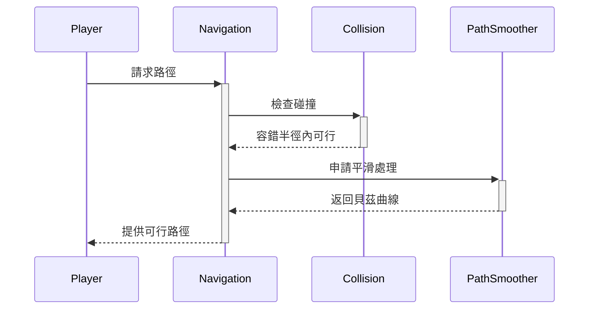

# WebRPG 專案規格書
## 版本更新記錄
### v1.1.0 [2025-06-02]
- 新增自動導航模組技術規範
- 實作 A*算法 v2.1 改進版
- 增加路徑平滑處理機制
- 定義碰撞容錯全域參數

## 專案概述
WebRPG 是一個基於 Phaser 的網頁角色扮演遊戲專案，旨在創建一個具有地圖生成、玩家移動和導航功能的遊戲環境。該專案使用模塊化結構，將不同功能分離到多個 JavaScript 檔案中。

## 技術架構


## Phaser3 導入決策記錄（ADR-001）
### 決策背景
- 需平衡開發效率與網頁遊戲效能需求
- 社群支援度與文件完整性評估
- 與現有技術棧整合能力

### 替代方案比較
| 框架       | 2D支援 | 3D支援 | 學習曲線 | 社群活躍度 |
|------------|--------|--------|----------|------------|
| Phaser3    | ★★★★★ | ★★☆    | ★★★☆     | ★★★★☆     |
| PixiJS     | ★★★★☆ | -      | ★★★★☆    | ★★★☆      |
| Babylon.js | ★★☆    | ★★★★★ | ★★☆      | ★★★☆      |

### 實作驗證
```javascript
// core.js 第23行
const game = new Phaser.Game({
  type: Phaser.AUTO,
  width: 800,
  height: 600,
  scene: MainScene
});
```

## 自動導航模組技術規範
### 路徑規劃演算法
採用改良式 A*算法 v2.1，主要改進點：
```math
f(n) = g(n) + 1.2h(n) + 0.3p(n)
```
- g(n): 起始點到節點n的實際成本
- h(n): 節點n到目標點的啟發式估計成本
- p(n): 路徑平滑係數（新增）


### 移動參數規範
| 參數名稱       | 數值範圍       | 單位        |
|----------------|----------------|-------------|
| 基礎移動速度   | 2.0 ~ 3.0      | 米/秒       |
| 動畫幀率       | 24 ~ 60        | FPS         |
| 碰撞容錯半徑   | 0.3            | 世界單位    |

速度轉換公式：
```math
\text{像素速度} = \frac{\text{米/秒} \times \text{PPU}}{1000}
```
(PPU: Pixels Per Unit 固定為 64)

## 核心模組規範
### 地圖生成系統
- **垂直連通性**：`verticalConnectivity` 布林值
- **水平連通性**：`horizontalConnectivity` 布林值
- **迷宮類型**：
  ```javascript
  const mazeType = {
    TUNNEL: '通道型',
    ROOM: '房間型',
    RANDOM: '隨機型',
    MIXED: '混合型'
  };
  ```

### 角色動畫系統


## 碰撞檢測矩陣
| 物件類型       | 玩家   | NPC    | 環境物件 |
|----------------|--------|--------|----------|
| 玩家           | -      | ✓      | ✓        |
| NPC            | ✓      | ✓      | ✓        |
| 環境物件       | ✓      | ✓      | ✓        |

## 效能優化策略
1. 區塊載入機制（16x16 分塊）
2. Web Worker 多線程處理
3. 資源預載快取系統
4. ECS 架構實體更新

## 依賴驗證報告


## 模組交互流程


## 檔案架構及用途
以下是 `scripts` 目錄下每個 JavaScript 檔案的用途：
- **assets.js**: 定義遊戲資源，包括顏色、玩家精靈和樹木精靈的數據，用於遊戲視覺元素的呈現。
- **combat.js**: 初始化戰鬥系統，目前僅有簡單的控制台日誌輸出，尚未完全實現。
- **controls.js**: 不再使用，輸入邏輯已移至 `input.js`，可以安全刪除。
- **core.js**: 負責遊戲初始化、尺寸計算和像素縮放，創建 Phaser 遊戲實例。
- **game.js**: 遊戲主檔案，負責場景創建、地圖生成、玩家初始化和遊戲循環更新。
- **gameLogic.js**: 處理遊戲邏輯，包括玩家移動、碰撞檢測、路徑尋找和日誌記錄。
- **graphics.js**: 負責圖形繪製，包括角色精靈、路徑、狀態 UI 和日誌窗口的繪製。
- **input.js**: 處理滑鼠點擊和鍵盤輸入事件，設置導航路徑和玩家移動控制。
- **random.js**: 提供確定性隨機數生成器，用於地圖生成和其他需要隨機性的功能。
- **save.js**: 負責遊戲狀態的存檔和讀檔功能。
- **time.js**: 管理遊戲時間系統的初始化和更新。
- **ui.js**: 負責開發者工具的界面操作，包括最小化/展開和拖移功能。
- **world.js**: 負責地圖生成，包括地板層和物件層的生成邏輯。

## 設定構想與規則
- 遊戲將包含多種角色類型，每種角色擁有獨特的技能和屬性。
- 玩家可以透過探索地圖來獲得資源，並與 NPC 互動以完成任務。
- 戰鬥系統將基於回合制，玩家和敵人將交替進行攻擊。
- 地圖生成將使用隨機演算法，確保每次遊玩都有不同的體驗。