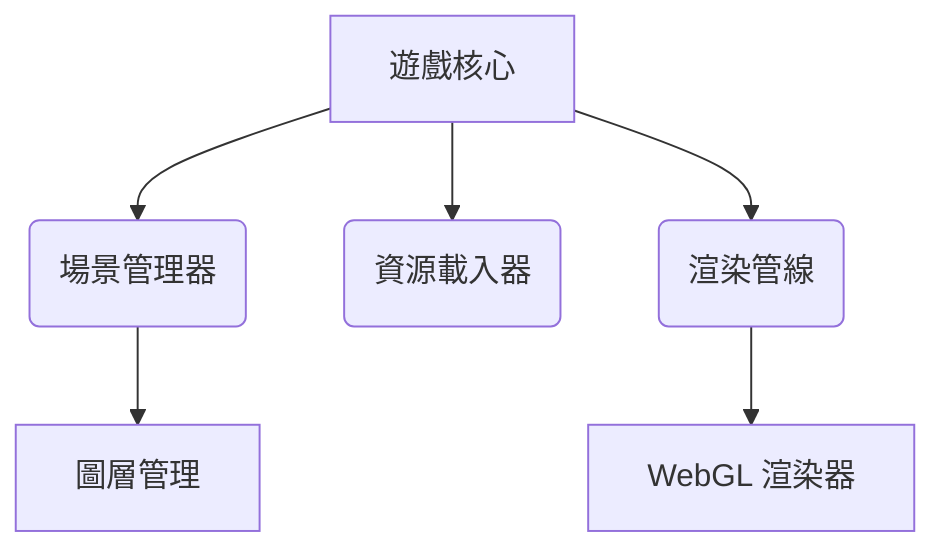
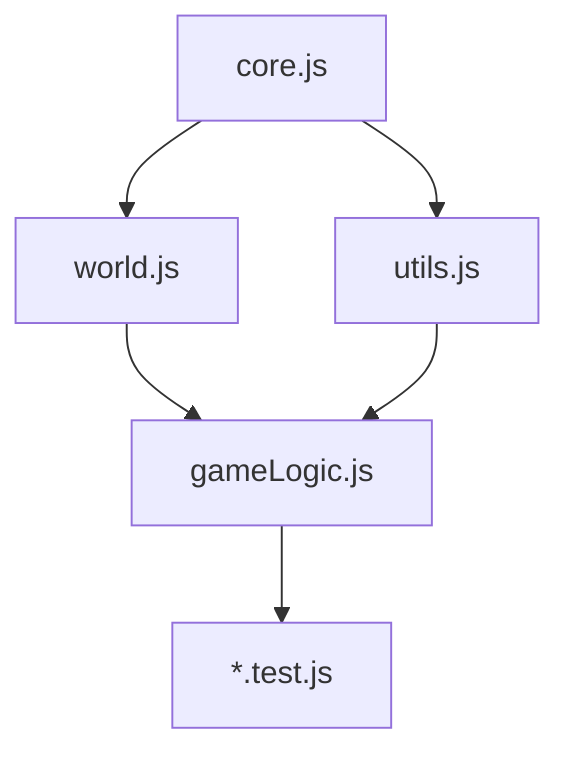

# WebRPG 專案規格書

## 原始專案規劃
### 核心目標
- 建置跨平台 2.5D RPG 遊戲引擎
- 實現動態視角切換功能
- 支援大規模場景渲染

### 初始功能列表
1. 場景管理系統
2. 角色控制模組
3. 基礎物理碰撞檢測
4. 2D/等角視角切換
5. 基礎光影渲染

## 系統架構藍圖


## 技術選型
| 項目 | 選擇 | 理由 |
|------|------|------|
| 遊戲框架 | Phaser 2 | 成熟度高、社群支援豐富 |
| 建置工具 | Webpack | 模組化支援完善 |
| 渲染引擎 | WebGL 1.0 | 相容性考量 |
| 測試框架 | Mocha | 靈活性高 |

## 架構演進 (2025/6/10)
### 核心模組升級
- **WorldModule**
  - 舊：IIFE 模式 → 新：ES6 Class
  - 新增矩陣投影系統
- **場景圖層**
  - 從 3 層擴充至 5 層架構
  - 新增深度緩衝管理

### 技術規格更新
```diff
+ 前端框架: Phaser 3 + Vite
- 前端框架: Phaser 2 + Webpack

+ 渲染引擎: WebGL 2.0
- 渲染引擎: WebGL 1.0

+ 測試框架: Jest + jest-canvas-mock
- 測試框架: Mocha + Chai
```

## API 端點規範
### 保留原始設計
- `/api/load-scene` (GET)
  - 參數: { sceneId: Number }
  - 回傳: { layers: Array }

### 新增端點
- `/api/map-generate` (POST)
  - 參數: { seed: String, difficulty: Number }
  - 回傳: { ground: Array, objectLayer: Array }

## 模組分工架構
### 核心系統
- **core.js**
  `職責`：遊戲引擎初始化與基礎管理
  `功能`：
  - 建立/銷毀 Phaser 遊戲實例
  - 處理畫面尺寸計算與縮放
  - 管理視窗 resize 事件
  `關鍵函式`：
  ```javascript
  export function initializeGame(config) { /*...*/ }
  export function calculateGameSize() { /*...*/ }
  ```

### 遊戲邏輯
- **world.js**
  `職責`：世界生成與視覺管理
  `功能`：
  - 地圖生成（通道/房間/隨機類型）
  - 地圖可達性驗證
  - 等角投影系統初始化
  - 視覺模式切換（2D/2.5D）
  - 場景分層渲染與深度排序
  `關鍵演算法`：
  ```javascript
  // 地圖生成核心邏輯
  export function generateMapLayers(mapData) {
    // 包含種子生成、安全區域設置、迷宮類型判斷
  }
  
  // 視覺模式切換
  export function toggleViewMode(scene) {
    viewMode = viewMode === '2D' ? '2.5D' : '2D';
    updateViewMode(scene);
  }
  ```

- **gameLogic.js** (待補充)
  `職責`：遊戲規則與狀態管理
  `功能`：
  - 角色屬性計算
  - 戰鬥傷害公式
  - 任務進度追蹤

- **combat.js**
  `職責`：戰鬥系統核心
  `當前進度`：基礎框架建立
  `規劃功能`：
  - 回合制戰鬥流程
  - 屬性相剋系統
  - 技能效果堆疊機制
  `示例代碼`：
  ```javascript
  // 戰鬥系統初始化（當前實現）
  export function initializeCombat(scene) {
    console.log('初始化戰鬥系統');
  }
  ```

### 輸入處理
- **input.js**
  `職責`：統一輸入管理
  `功能`：
  - 鍵盤/滑鼠事件處理
  - 輸入映射配置
  - 手把支援擴充
  `架構特點`：
  - 合併原 controls.js 功能
  - 支援多種輸入裝置

## 廢棄文件
- ~~controls.js~~
  `狀態`：已遷移至 input.js
  `建議動作`：
  ```bash
  rm scripts/controls.js
  ```

### 工具函式庫
- **utils.js** (待補充)
  `職責`：通用工具方法
  `功能`：
  - 數學計算輔助
  - 資料格式轉換
  - 效能監測工具

### 測試套件
- **/*.test.js**
  `職責`：單元測試與整合測試
  `功能`：
  - 驗證核心模組功能
  - 壓力測試場景載入
  - 跨瀏覽器相容性驗證



## 版本控制聲明
1. 使用刪除線標示過時規格
2. 新增修改對照表
3. 保留完整變更歷程
4. 維護模組分工文件